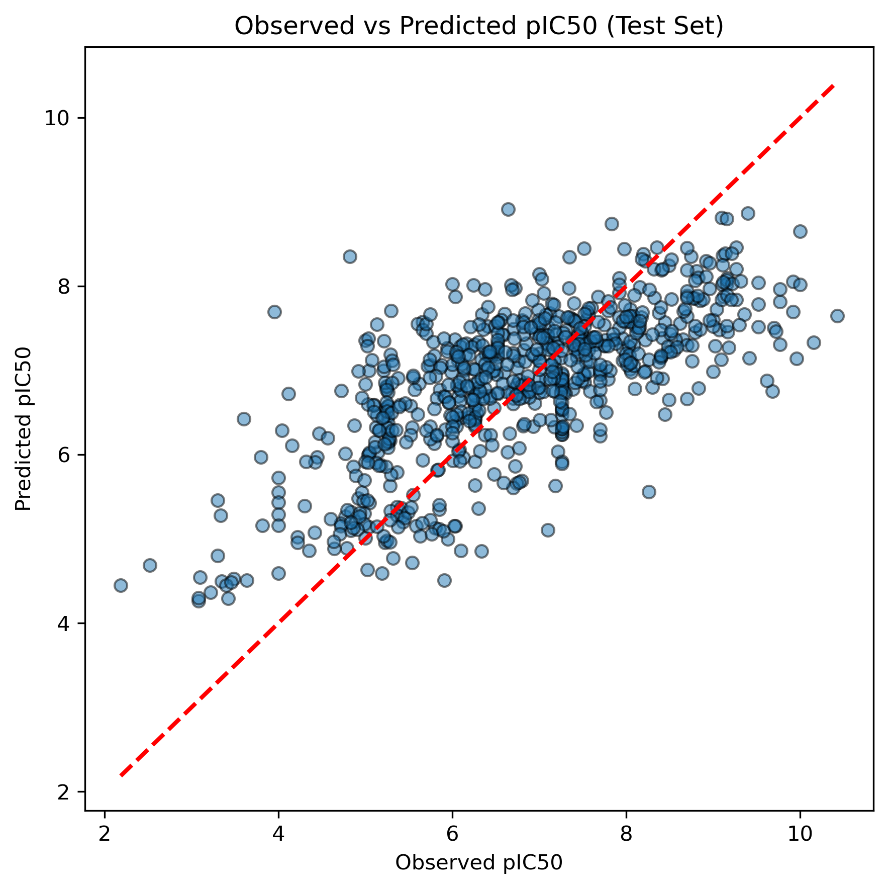
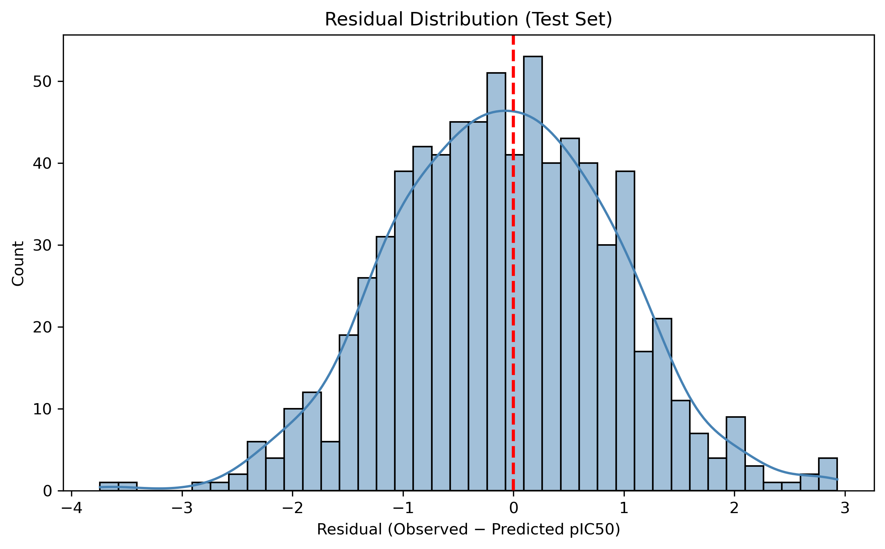
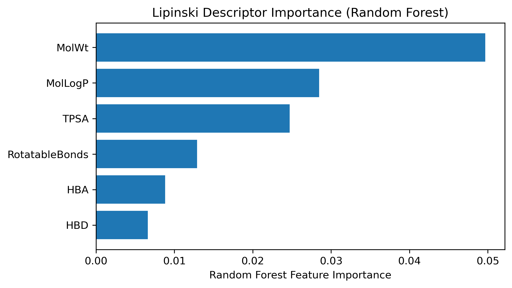

#  QSAR Regression for EGFR Kinase Inhibition (ChEMBL)

##  Project Overview

This project presents a QSAR regression pipeline for predicting the inhibitory potency of small molecules against the EGFR kinase (CHEMBL203) using experimentally measured IC50 values from the ChEMBL bioactivity database.

The goal is to build a chemically consistent and machine-learning–driven model that can prioritize potent kinase inhibitors based solely on molecular structure, thereby accelerating early-stage drug discovery.

##  Why EGFR and QSAR?

EGFR is a well-established oncology target, and kinase inhibitors represent one of the most important drug classes in cancer therapy. However, experimental IC50 measurements are:

- Costly  
- Time-consuming  
- Limited in throughput  

QSAR models offer a scalable alternative by predicting compound potency in silico before laboratory testing.

##  Dataset Description

- **Source:** ChEMBL bioactivity database  
- **Target:** EGFR (CHEMBL203)  
- **Assay type:** Binding assays only (assay_type = "B")  
- **Activity type:** Exact IC50 measurements (relation = "=")  
- **Units:** nM (converted to molar units)  
- **Quality filter:** confidence_score ≥ 8  

##  Target Variable

IC50 values were converted to pIC50 using:   pIC50 = −log10(IC50 [M])

This transformation stabilizes variance and makes the regression target more suitable for modeling.

##  Data Curation and Standardization

- Canonical SMILES were standardized using RDKit to obtain a consistent `std_smiles` representation  
- Invalid molecules and missing SMILES were removed  
- Duplicate molecules (same `std_smiles`) were merged using median pIC50  

Chemical space sanity checks were performed:

- SMILES length distribution  
- Heavy atom count distribution  

No abnormal outliers outside the small-molecule domain were observed.

##  Dataset Reduction (Efficiency)

Due to computational constraints, a chemically diverse subset of 5,000 molecules was selected from the full dataset using the Kennard–Stone algorithm, ensuring representative coverage of chemical space before descriptor calculation and modeling.

##  Feature Engineering

### Molecular Representations

**Physicochemical descriptors (Lipinski-like):**

- Molecular Weight (MolWt)  
- LogP (MolLogP)  
- HBD, HBA  
- TPSA  
- Rotatable Bonds  

**Structural fingerprints:**

- Morgan fingerprints (ECFP4)  
- Radius = 2  
- 2048 bits  

A hybrid feature set combining descriptors and fingerprints was used for modeling.

##  Data Splitting Strategy

To avoid overly optimistic performance due to structural leakage:

- Scaffold-based splitting was applied  
- Data was divided into:
  - Train  
  - Validation  
  - Test sets  

This ensures evaluation on unseen chemical scaffolds, reflecting real-world drug discovery scenarios.

##  Modeling Approach

### Baseline Model
- **Ridge Regression**  
- Purpose: establish a stable linear baseline under high-dimensional feature space  

### Non-Linear Model
- **Random Forest Regression**  
- Captures non-linear structure–activity relationships common in kinase datasets  

### Hyperparameter Tuning
- Performed using the validation set only  
- Final model retrained on Train + Validation  
- Final performance reported on the held-out Test set  

##  Model Performance (Test Set)

| Model          | RMSE | MAE  | R²   |
|----------------|------|------|------|
| Ridge          | ~1.15 | ~0.91 | ~0.33 |
| Random Forest  | 1.01 | 0.81 | 0.50 |

The Random Forest model showed clear improvements, highlighting the importance of non-linear modeling for EGFR structure–activity relationships.

##  Model Evaluation & Visualization

### Observed vs Predicted pIC50 (Test Set)

This plot shows strong agreement between observed and predicted pIC50 values on the held-out test set, demonstrating good generalization performance of the final Random Forest model across diverse chemical scaffolds.

---

### Residual Distribution (Test Set)

Residuals are centered around zero with no strong systematic bias, supporting the reliability of the model predictions.

---

### Descriptor Feature Importance (Random Forest)

Molecular weight, lipophilicity, and polar surface area emerge as the most influential physicochemical descriptors, consistent with known EGFR kinase SAR.

##  Feature Importance Analysis (Chemical Interpretation)

Random Forest feature importance was analyzed for Lipinski descriptors only to ensure interpretability.

**Key findings:**

- Molecular weight and lipophilicity dominate predictive importance  
- Polar surface area contributes significantly  
- Hydrogen bond counts play a secondary role  

These results are consistent with known EGFR kinase structure–activity relationships, where hydrophobic interactions and molecular shape strongly influence binding affinity.

##  Limitations and Future Work

- Fingerprint-based models lack direct substructure interpretability  
- Impurity-based feature importance may introduce bias  
- External validation on independent datasets was not performed  
- Advanced explainability methods (e.g., SHAP, permutation importance)  
- Exploration of graph neural networks (GNNs) could further enhance performance  

##  Key Takeaways

- Demonstrates a complete, end-to-end QSAR regression workflow  
- Combines chemical intuition with modern machine learning  
- Avoids common pitfalls such as scaffold leakage  
- Designed with real drug discovery constraints in mind  

## 🛠 Tools & Libraries

- Python  
- RDKit  
- scikit-learn  
- pandas / NumPy / matplotlib / seaborn  
- ChEMBL WebResource Client  

## 👤 Author

**Nezihe Mohiuddin**  
Chemistry (MSc) | Aspiring Drug Discovery Data Scientist

